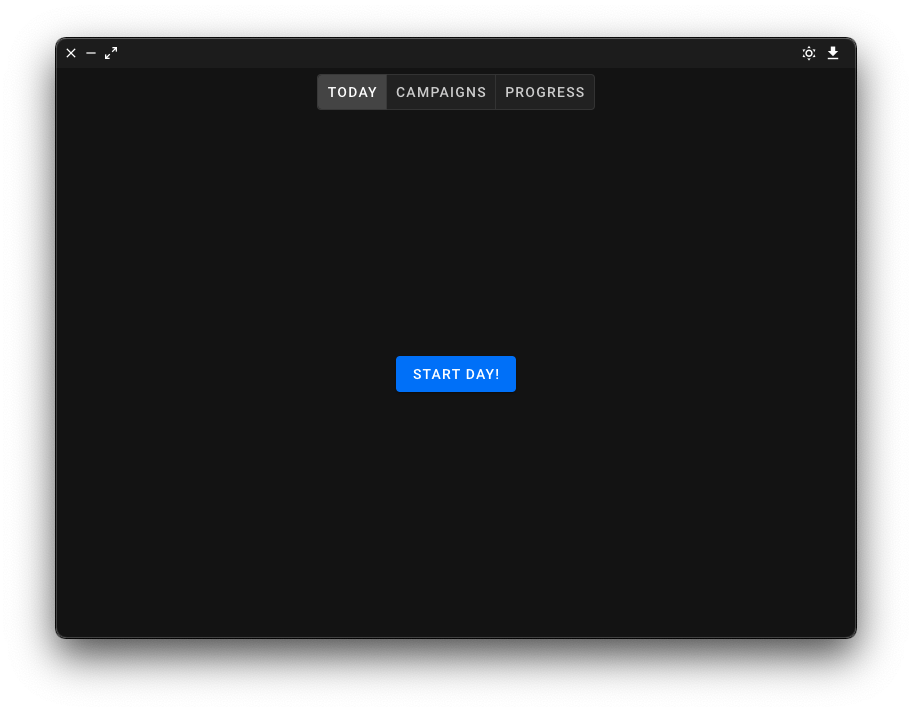
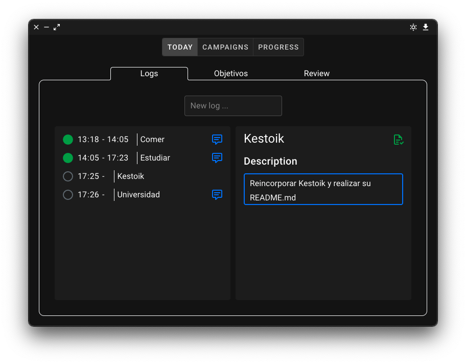
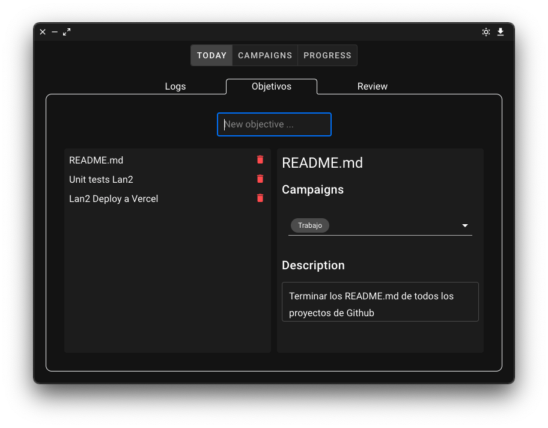
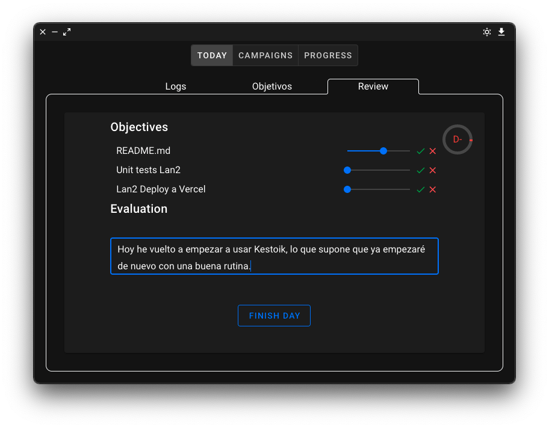
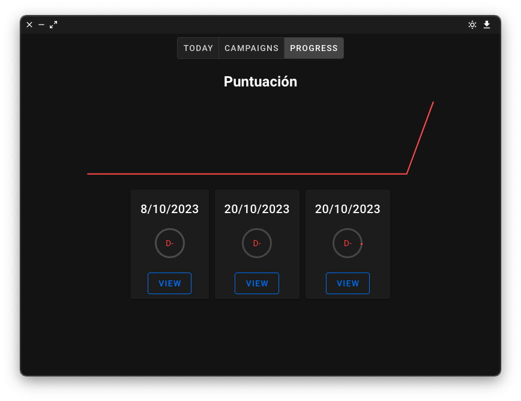
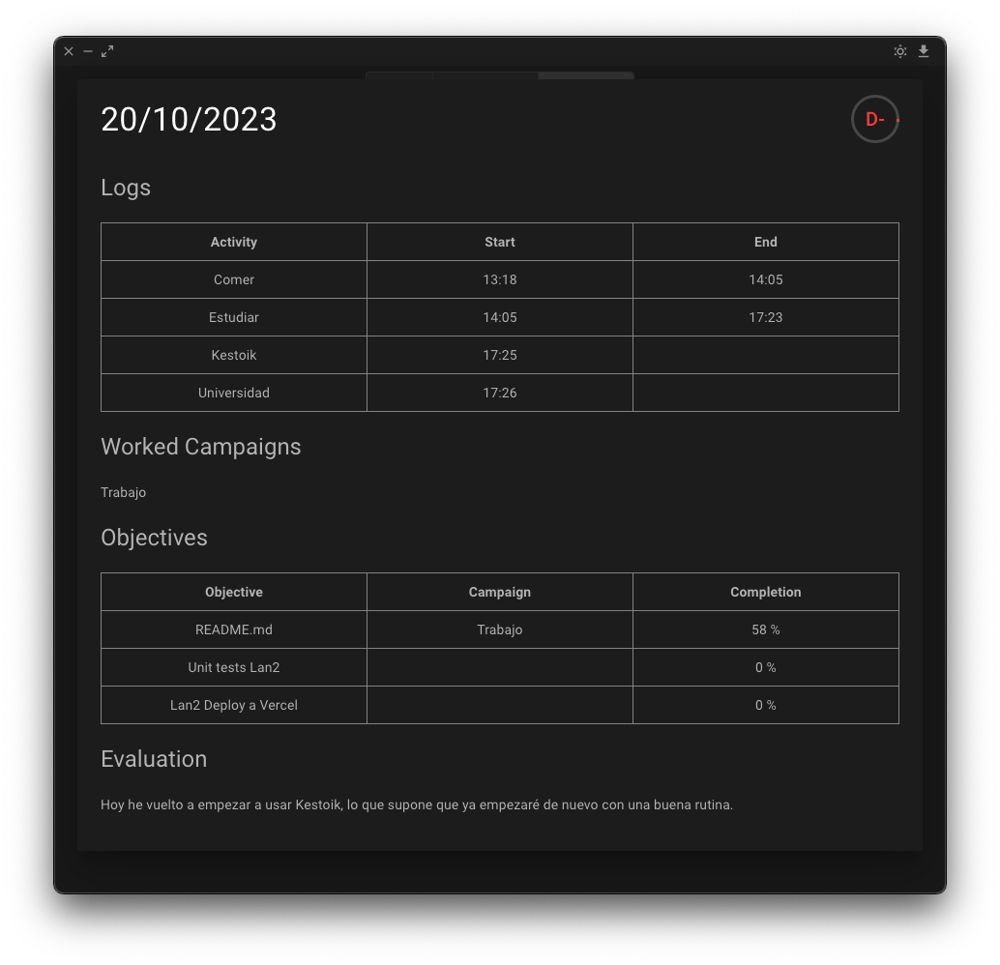
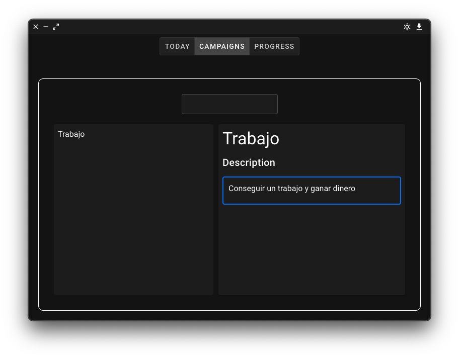
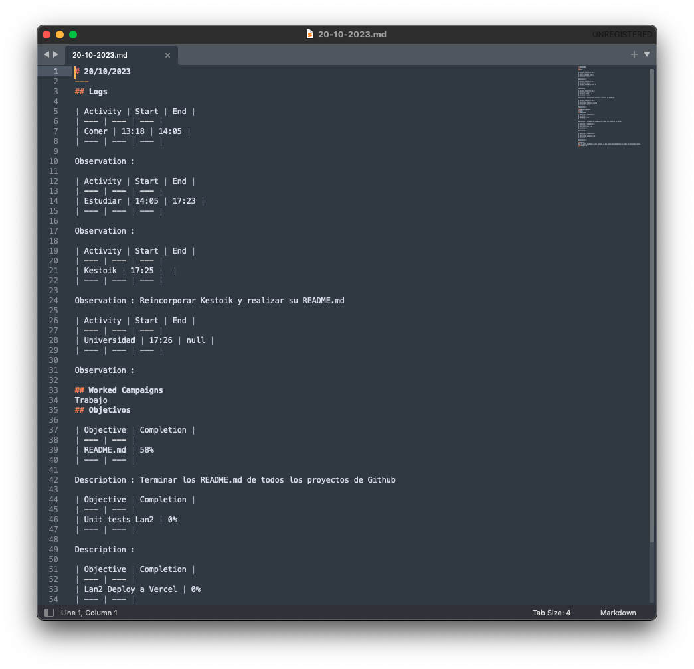

# Kestoik

Your life tracker. This app's aim is to let you track and gather as much data as possible for your life. It relies on a series of logs, that you input, some goals you set and from there it keeps track of your progress.

## How it works

### Today

Each day you start it pressing the start button.
### Logs

On the logs sections you write down the different activities that you perform. Uppon writing them, it sets the start time to the moment you add the log. When clicking the circle, the finish time is recorded. Of course you can edit all of this later too. For each log you describe it more deeply too.
### Objectives

Each day you decide a set of objectives too. You can set a description too, and you can add tags called campaigns. We will explain later what campaigns are.

### Review

At the end of the day you mark the accomplished objectives, it can be a gradient if you feel like you did it but not at your fullest potential. At the end you set your personal evaluation, and a score is calculated based on the amount of objectives, and how much of them you have accomplished.

## Progress

On the progress section you can visualize the scores you have been getting. Red means bad, green means good. You can also view each day individually to see what logs did you did, the campaigns you worked on, the objectives stats, and your evaluation.

## Campaign

The campaigns are bigger objectives, more long term projects you set. They aren't your traditional daily objective, but they are rather a more big, objective.

## Other features

### Light/Dark mode

Of course, we can't miss the toggle between dark and light mode!

### MD export

Each day is exported automatically to an MD file and is stored in your desktop. You can click the download button if you want to save your current progress into it.
Here we can see the exported day on Sublime Text 3.

## Technologies used

Kestoik is built with Vue and Electron, and of course Node. 

## Future additions

### Github and Google integration

You will be able to integrate your Google activity for more automatic logging and to track the time you spend using apps and on different websites. Github integration will let you import your issues, and milestones into your daily plans!

### More customizable campaigns

Campaigns are now quite dull. In the future we will add different plans, or sub campaigns, milestones, dates and more metrics. Other types of campaigns will serve as your reminders.

###  Schedules

Schedules will be different objectives and activities templates so you can set different schedules so you can have a more regular routine.

### Epic scoring

Letter scoring with letters is cool, but we are planning to add different ways of showing your progress. Different milestones, and badges will be unlocked when you are hardworking and constant. We will take inspiration from Habitica and let you gamify your life!
### Data

Kestoik's aim is to collect as much valuable data to help you enhance your productivity and well-being. Here are some key metrics and insights we are working on:

- **Completion Percentage:** Measure your progress by tracking the percentage of completed tasks and objectives.
- **Task Duration:** Analyze the time spent on each task to identify areas for improvement.
- **Actions Taken:** Keep a record of actions completed throughout the day.
- **Training Improvement:** Track your progress in training or skill-building activities.
- **Habits:** Monitor and build positive habits over time.
- **Time Between Actions:** Optimize your workflow by analyzing the time intervals between tasks.
- **Concentration Time:** Measure how long you can maintain focus on a task.
- **Emotional Insights:** Record your emotional states to better understand their impact on productivity.
- **Calories:** If fitness or nutrition is a focus, log your daily calorie intake.

## Conclusion

Kestoik is your go-to productivity app, helping you track, analyze, and optimize your daily activities and long-term goals. Stay organized, improve your efficiency, and achieve your objectives with Kestoik.
